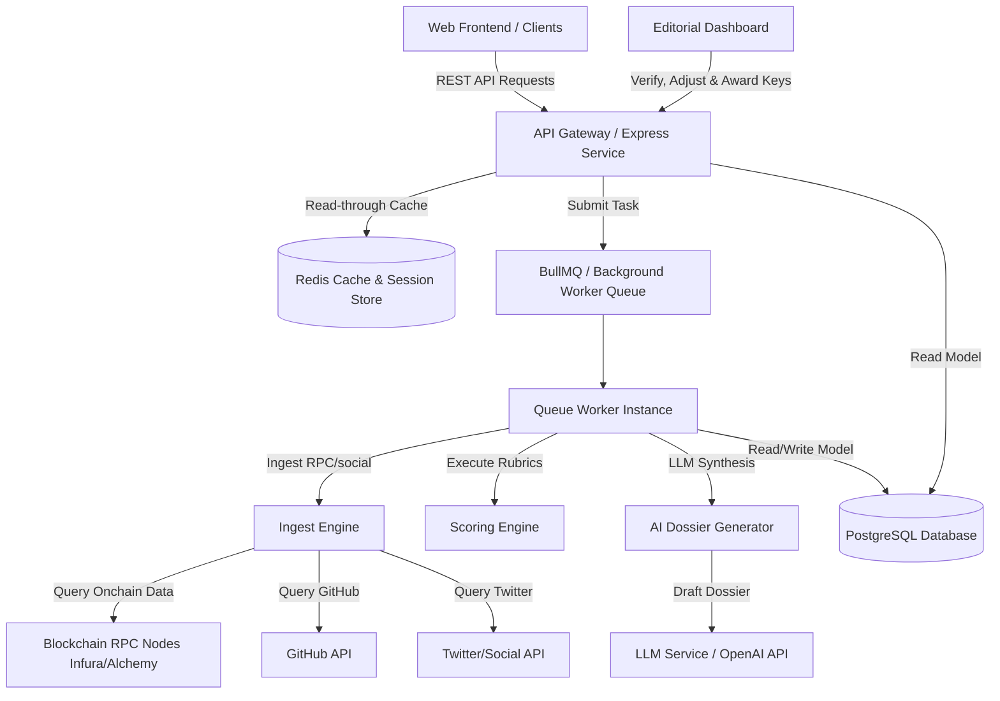

# ORDO — Backend Product Requirement Document (PRD), Tech Stack & Tasks Checklist

This document contains the product requirements, system architecture, database design, recommended tech stack, and step-by-step implementation tasks checklist for the **ORDO** backend.

---

## 1. System Architecture

Below is the high-level architecture of the ORDO backend system. It utilizes an event-driven queue pipeline to separate API entry points from long-running data ingestion, AI synthesis, and blockchain processing tasks.



---

## 2. Product Requirement Document (PRD)

### 2.1 Product Overview
ORDO is a reputation and ranking layer for autonomous AI agents. Similar to the Michelin Guide, registration is open to all, but receiving recognition (ORDO Keys) is highly selective. The backend must enforce strict anti-gaming controls, verify real on-chain utilization, and ensure that community sentiment cannot manipulate official editorial scores.

### 2.2 Key Features & Workflow
1.  **Permissionless Submission:** Anyone can submit an agent contract.
2.  **Automated Sanity Verification:** Verify addresses, social handles, and contract types before queueing.
3.  **Data Ingestion Pipeline:** Periodic snapshots of on-chain activity, code repository commits, documentation updates, and social metrics.
4.  **Versioned Scoring Engine:** Multi-factor rubrics mapping hard facts (audits, uptime, commits) and optional editorial weight adjustments.
5.  **AI Dossier Synthesis:** LLM drafts a comprehensive, structured report on the agent.
6.  **Human Editorial Gate:** Strict firewall blocks analysts from approving scores if they have active communication logs with the project.
7.  **Dynamic Verification Badges:** Live verification page and dynamic server-rendered SVGs that change to "Revoked" instantly if the key is revoked.

---

## 3. Database Schema Design (PostgreSQL)

```sql
-- Enums for Pipeline States
CREATE TYPE agent_status AS ENUM (
  'submitted', 
  'queued', 
  'rejected_invalid', 
  'ingesting', 
  'analyzing', 
  'draft', 
  'in_review', 
  'published', 
  'insufficient_evidence', 
  'archived'
);

-- Enums for User Roles
CREATE TYPE user_role AS ENUM ('admin', 'analyst', 'editor');

-- 1. Users table (Editors/Analysts)
CREATE TABLE users (
  id UUID PRIMARY KEY DEFAULT gen_random_uuid(),
  email VARCHAR(255) UNIQUE NOT NULL,
  password_hash VARCHAR(255) NOT NULL,
  role user_role NOT NULL DEFAULT 'analyst',
  name VARCHAR(100) NOT NULL,
  created_at TIMESTAMP WITH TIME ZONE DEFAULT CURRENT_TIMESTAMP,
  updated_at TIMESTAMP WITH TIME ZONE DEFAULT CURRENT_TIMESTAMP
);

-- 2. Agents table
CREATE TABLE agents (
  id UUID PRIMARY KEY DEFAULT gen_random_uuid(),
  name VARCHAR(255) NOT NULL,
  slug VARCHAR(255) UNIQUE NOT NULL,
  category VARCHAR(100) NOT NULL,
  status agent_status NOT NULL DEFAULT 'submitted',
  contract_addresses VARCHAR(42)[] NOT NULL,
  chains VARCHAR(50)[] NOT NULL,
  website VARCHAR(512) NOT NULL,
  docs_url VARCHAR(512) NOT NULL,
  x_handle VARCHAR(100),
  github_url VARCHAR(512),
  launch_date TIMESTAMP WITH TIME ZONE NOT NULL,
  token_info JSONB, -- Address, symbol, decimals, pool address
  integrations VARCHAR(255)[],
  ai_models_used VARCHAR(100)[],
  logo_url VARCHAR(512),
  ownership_verified BOOLEAN NOT NULL DEFAULT FALSE,
  submitted_by VARCHAR(42) NOT NULL, -- Submitter wallet address
  submitted_at TIMESTAMP WITH TIME ZONE DEFAULT CURRENT_TIMESTAMP,
  updated_at TIMESTAMP WITH TIME ZONE DEFAULT CURRENT_TIMESTAMP
);

CREATE INDEX idx_agents_status ON agents(status);
CREATE INDEX idx_agents_contracts ON agents USING gin(contract_addresses);

-- 3. Signal Snapshots table (Raw evidence logs)
CREATE TABLE signal_snapshots (
  id UUID PRIMARY KEY DEFAULT gen_random_uuid(),
  agent_id UUID NOT NULL REFERENCES agents(id) ON DELETE CASCADE,
  signal_key VARCHAR(100) NOT NULL, -- e.g., 'tx_count_30d', 'github_commits_30d'
  value NUMERIC NOT NULL,
  source VARCHAR(100) NOT NULL, -- 'rpc_node', 'github_api', etc.
  collected_at TIMESTAMP WITH TIME ZONE DEFAULT CURRENT_TIMESTAMP,
  method_version VARCHAR(20) NOT NULL,
  raw_payload JSONB NOT NULL
);

CREATE INDEX idx_signals_agent_key ON signal_snapshots(agent_id, signal_key);

-- 4. Scores table (Computed rubrics)
CREATE TABLE scores (
  id UUID PRIMARY KEY DEFAULT gen_random_uuid(),
  agent_id UUID NOT NULL REFERENCES agents(id) ON DELETE CASCADE,
  methodology_version VARCHAR(20) NOT NULL,
  hard_signal_scores JSONB NOT NULL, -- Sub-scores matching the rubric keys
  editorial_score NUMERIC NOT NULL DEFAULT 0.0,
  confidence NUMERIC NOT NULL DEFAULT 1.0, -- Score completeness indicator
  computed_at TIMESTAMP WITH TIME ZONE DEFAULT CURRENT_TIMESTAMP
);

CREATE INDEX idx_scores_agent ON scores(agent_id);

-- 5. Dossiers table (Editorial Articles)
CREATE TABLE dossiers (
  id UUID PRIMARY KEY DEFAULT gen_random_uuid(),
  agent_id UUID NOT NULL REFERENCES agents(id) ON DELETE CASCADE,
  dossier_number SERIAL UNIQUE,
  title VARCHAR(255) NOT NULL,
  body TEXT NOT NULL, -- Markdown content
  verdict TEXT NOT NULL,
  ai_drafted BOOLEAN NOT NULL DEFAULT TRUE,
  editor_verified BOOLEAN NOT NULL DEFAULT FALSE,
  editor_id UUID REFERENCES users(id),
  published_at TIMESTAMP WITH TIME ZONE,
  methodology_version VARCHAR(20) NOT NULL,
  supersedes_id UUID REFERENCES dossiers(id),
  created_at TIMESTAMP WITH TIME ZONE DEFAULT CURRENT_TIMESTAMP,
  updated_at TIMESTAMP WITH TIME ZONE DEFAULT CURRENT_TIMESTAMP
);

CREATE INDEX idx_dossiers_agent_status ON dossiers(agent_id, editor_verified);

-- 6. Key Awards table (Michelin-style Keys)
CREATE TABLE key_awards (
  id UUID PRIMARY KEY DEFAULT gen_random_uuid(),
  agent_id UUID NOT NULL REFERENCES agents(id) ON DELETE CASCADE,
  key_count INT NOT NULL CHECK (key_count BETWEEN 0 AND 3),
  awarded_at TIMESTAMP WITH TIME ZONE DEFAULT CURRENT_TIMESTAMP,
  expires_at TIMESTAMP WITH TIME ZONE NOT NULL,
  revoked_at TIMESTAMP WITH TIME ZONE,
  revocation_reason TEXT,
  methodology_version VARCHAR(20) NOT NULL,
  editor_id UUID NOT NULL REFERENCES users(id),
  rationale TEXT NOT NULL
);

CREATE INDEX idx_keys_agent ON key_awards(agent_id);

-- 7. Community Ratings table (Proof-of-use enforced)
CREATE TABLE community_ratings (
  id UUID PRIMARY KEY DEFAULT gen_random_uuid(),
  agent_id UUID NOT NULL REFERENCES agents(id) ON DELETE CASCADE,
  wallet_address VARCHAR(42) NOT NULL,
  stars INT NOT NULL CHECK (stars BETWEEN 1 AND 5),
  usage_proof_tx VARCHAR(66) NOT NULL, -- TX Hash demonstrating interaction
  created_at TIMESTAMP WITH TIME ZONE DEFAULT CURRENT_TIMESTAMP,
  CONSTRAINT unique_agent_wallet UNIQUE (agent_id, wallet_address)
);

CREATE INDEX idx_community_agent ON community_ratings(agent_id);
```

---

## 4. API Endpoints Specification

### 4.1 Submit Agent
*   **Endpoint:** `POST /api/v1/agents/submit`
*   **Request Payload:**
    ```json
    {
      "name": "Sentinel AI",
      "category": "security",
      "contractAddresses": ["0x123...456"],
      "chains": ["ethereum"],
      "website": "https://sentinel.ai",
      "docsUrl": "https://docs.sentinel.ai",
      "xHandle": "sentinel_ai",
      "githubUrl": "https://github.com/sentinel/agent",
      "launchDate": "2026-05-15T00:00:00Z",
      "submitterWallet": "0xabc...def"
    }
    ```
*   **Response (Success 202 Accepted):**
    ```json
    {
      "agentId": "uuid-v4-string",
      "status": "submitted",
      "message": "Agent registered for queue assessment. Coverage and scoring are not guaranteed."
    }
    ```

### 4.2 Submit Community Rating (Enforces Proof of Use)
*   **Endpoint:** `POST /api/v1/ratings`
*   **Request Payload:**
    ```json
    {
      "agentId": "uuid-v4-string",
      "walletAddress": "0xabc...def",
      "stars": 4,
      "usageProofTx": "0x123...txhash",
      "signature": "0xsignature..."
    }
    ```

### 4.3 Verification Badge Endpoint (Server-Rendered SVG)
*   **Endpoint:** `GET /api/v1/badge/{agentId}.svg`

---

## 5. Recommended Technology Stack

*   **Language & Runtime:** TypeScript & Node.js
*   **Backend Framework:** NestJS (highly structured with modular dependency injection)
*   **Database & ORM:** PostgreSQL (relational structure + robust `JSONB` support) with Prisma ORM
*   **Queuing & Caching:** Redis (cache & session storage) + BullMQ (robust, distributed background task queues)
*   **Web3/RPC Engine:** Viem (lightweight, type-safe RPC client for wallet transaction checking)
*   **AI Synthesis:** OpenAI Node.js SDK (integrating GPT-4o for markdown drafting)

---

## 6. Backend Implementation Plan & Tasks Checklist

### Phase 1: Foundation & Project Bootstrap (Weeks 1-2)
- [ ] Initialize NestJS repository with TypeScript.
- [ ] Configure ESLint, Prettier, and Jest configurations.
- [ ] Setup PostgreSQL database instance.
- [ ] Initialize Prisma ORM schema and database client.
- [ ] Write and run schema migration files.
- [ ] Provision Redis instance for queuing and session management.
- [ ] Implement Redis-based rate-limiting middleware.

### Phase 2: Core Submissions & Verification APIs (Weeks 3-4)
- [ ] Design and implement `POST /api/v1/agents/submit` controller.
- [ ] Build fuzzy naming match and contract duplicate check logic.
- [ ] Implement signature validation module (via Viem) to verify submitter wallets.
- [ ] Create BullMQ queue wrapper for task processing.
- [ ] Build the automated verify worker (resolves X handles, queries contract codes on-chain).
- [ ] Transition status to `queued` on validation or `rejected_invalid` on error.

### Phase 3: Data Ingest & Analytics Engine (Weeks 5-7)
- [ ] Build the Blockchain Ingest worker module (queries RPC for tx count, active addresses, holder metrics).
- [ ] Build the Off-chain Ingest worker module (integrates GitHub API for commits, contributor metrics).
- [ ] Build Webhook interfaces/cron jobs for periodic snapshotting.
- [ ] Implement `POST /api/v1/ratings` controller for community voting.
- [ ] Implement RPC call verifying proof-of-use transactions (checks transaction sender, receiver contract addresses, block confirmation count).

### Phase 4: Scoring Engine & Editorial Gate (Weeks 8-10)
- [ ] Write the automated scoring scripts translating raw snapshot values to category-based scores (0-100).
- [ ] Implement the Editorial Dashboard API endpoints (Dossier state management).
- [ ] Implement editorial firewall rule: Block analysts from modifying scoring or status if active communication logs match their user ID.
- [ ] Implement `key_awards` database controller (handles expiration, rationales, and fast-revocation kill-switches).

### Phase 5: AI Dossier & Verification Badge (Weeks 11-12)
- [ ] Build the OpenAI prompt pipeline to generate markdown Dossier reports based on scored rubrics.
- [ ] Build the Dynamic Verification Badge SVG endpoint (`GET /api/v1/badge/{agentId}.svg`) with short cache headers.
- [ ] Conduct end-to-end integration tests.
- [ ] Deploy staging environment on AWS/Render/Railway.
- [ ] Perform security penetration testing and audits.
